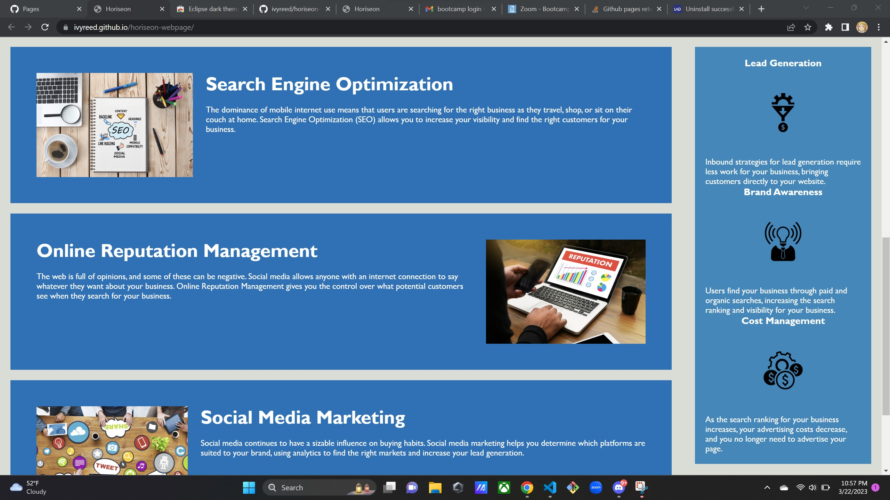

# Horiseon Webpage

## Description

This is a webpage for Horiseon which displays their search engine optimization, online reputation management, and social media marketing. This webpage also states Horiseons benefits which are lead generaation, brand awareness, and cost management.

## Installation

view he webpage a the following link https://ivyreed.github.io/horiseon-webpage/

## Usage

Navagate through the page by clicking the three links at the top.

## Credits

Starting code was gathered from (https://github.com/coding-boot-camp/urban-octo-telegram)

## License

Please refer to the LICENSE in the repo.
---
